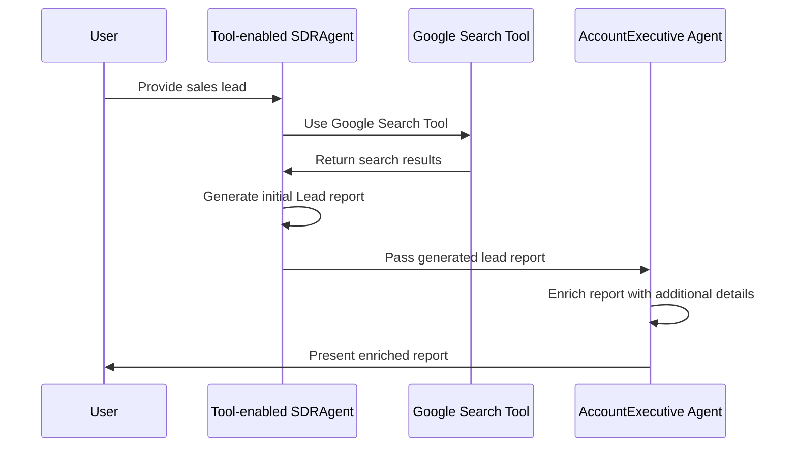

# MarketMuse

Your lead generation buddy. Built using the `autogen_core` library and [autogen >0.4](https://microsoft.github.io/autogen/dev//index.html).  


Current setup has the system prompts within each Agent. The Google search tool is using the [googlesearch-python](https://pypi.org/project/googlesearch-python/) package.
I chose to use this to avoid having to use/pay for 3rd party search apis. Its not perfect but its free. Id recommend running this on a VPN in general to avoid getting blocked by sites.

## Setup
We chose UV for our local development and these setup instructions will match that flow.  

### Project Setup  
From the root directory run:  
`uv init && uv sync` - This will download the project dependencies.

### LLM setup
You can run this app with a local model on a openai compatible server or an openai gpt model with your own api key.  
I would recommend choosing the local model route to experience the challenges faced with different hardware and less compute power.
Plus running models locally provides you the opportunity to explore various models free of charge while having the opportunity to 
explore performance and precision on less capable machines. If you have an M1 chip with at least 32GB of RAM you should be fine to run up to 12B parameter models.

For local server I would recommend [Ollama](https://ollama.com/). They have an open ai compatible api that works out of the box and supports vision models and tools calling.
And it is fairly straightforward to get a model running.  
Models I was experimenting with were:
- [Qwen2.5](https://ollama.com/library/qwen2.5)
- [Mistral-nemo](https://ollama.com/library/mistral-nemo)  

You can choose any model as long as it supports tool calling. You can view ollama models with tool support [here](https://ollama.com/search?c=tools)  

### Running the application
This is a command line application with the following arguments
```
usage: main.py [-h] --name NAME --company-name COMPANY_NAME --model-name MODEL_NAME
               [--openai-local-url OPENAI_LOCAL_URL] [--api-key API_KEY] [--vision-enabled VISION_ENABLED]

Configure the AI agent.

options:
  -h, --help            show this help message and exit
  --name NAME           Full name of the lead to research
  --company-name COMPANY_NAME
                        Company name to research
  --model-name MODEL_NAME
                        The name of the model to use.
  --openai-local-url OPENAI_LOCAL_URL
                        The local URL to your openapi enabled server like ollama. Will default to base open ai
                        URL if omitted
  --api-key API_KEY     OpenAI api key. Only required if you are using openai server or your local server
                        requires a key
  --vision-enabled VISION_ENABLED
                        Model supports Vision.
```

**An example run would be:**  
```
uv run main.py --name "Jenny Farver" --company-name "8th Light" --model-name qwen2.5:14b --openai-local-url http://localhost:11434/v1
```
